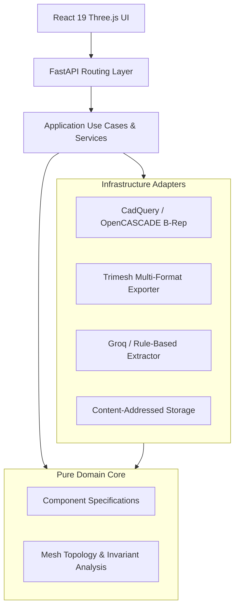

# ParametriCAD AI

Deterministic parametric CAD generation engine with domain-isolated topological mesh validation and an interactive 3D web viewer.

ParametriCAD AI builds exact boundary representation (B-Rep) solids with OpenCASCADE, tessellates them into polygon meshes, subjects the geometry to deterministic quality checks (watertightness, 2-manifold invariants, outward normal consistency, zero self-intersections), and publishes content-addressed artifacts in five engineering formats. Component specifications can be supplied via schema-driven parameter controls or extracted from natural language descriptions.

## Live Deployment

- **Web Application:** [parametricad.naindev.com](https://parametricad.naindev.com)
- **API Backend:** `https://parametricad-ai.onrender.com`

Example prompt:
> *pipe, diameter 25.5mm, wall 2mm, length 200mm*

---

## Spec-Driven Development (SDD)

This repository follows a strict Spec-Driven Development methodology. Every architectural decision, data model, and functional requirement is formally specified prior to implementation:

| Lifecycle Phase | Specification Document | Description |
|---|---|---|
| **01 Charter** | [`docs/01-charter.md`](docs/01-charter.md) | Mission, value proposition, and scope boundaries |
| **02 Requirements** | [`docs/02-requirements.md`](docs/02-requirements.md) | Functional and non-functional requirements in EARS syntax |
| **03 Open Questions** | [`docs/03-open-questions.md`](docs/03-open-questions.md) | Technical investigation register and future extensions |
| **04 Architecture** | [`docs/04-architecture.md`](docs/04-architecture.md) | Hexagonal architecture specification and interaction flowcharts |
| **05 Data Model** | [`docs/05-data-model.md`](docs/05-data-model.md) | Pydantic domain models, specifications, and Mermaid ER diagram |
| **06 Decisions** | [`docs/06-decisions/`](docs/06-decisions/) | Architecture Decision Records (ADR-0001 to ADR-0003) |
| **07 Tasks** | [`docs/07-tasks.md`](docs/07-tasks.md) | Granular task registry with ownership tags (`[A]`, `[M]`, `[H]`) |
| **08 Blockers** | [`docs/08-blockers.md`](docs/08-blockers.md) | External dependency risks and credential tracking |
| **09 Traceability** | [`docs/09-traceability.md`](docs/09-traceability.md) | Bi-directional matrix connecting EARS requirements to tests |
| **10 Runbook** | [`docs/10-runbook.md`](docs/10-runbook.md) | Local environment, container execution, and deployment operations |

Operational guidelines for autonomous development agents are defined in [`AGENTS.md`](AGENTS.md).

---

## Architecture

The system implements a strict Hexagonal Architecture (Ports and Adapters). The geometric domain core has zero knowledge of HTTP, disk persistence, or external CAD kernels.

```
backend/app/
  domain/          Pure geometric core: no I/O, no kernel lock-in, stateless
    geometry/      Mesh algorithms (topology, self-intersection, volume, normals)
    models/        Pydantic specifications, artifacts, validation results
    ports/         Abstract protocols implemented by infrastructure adapters
    errors.py      Domain exception hierarchy with machine-readable error codes
  application/     Pipeline orchestration, use cases, and capability catalog
  infrastructure/  External adapters: CadQuery/OpenCASCADE, Trimesh, Groq, Filesystem, FastAPI
```



**Core Invariant**: Mesh analysis and topological verification live inside the domain layer rather than delegating to interchangeable third-party mesh libraries. This ensures invariant verification remains testable in milliseconds without starting a heavy CAD kernel.

---

## Supported Mechanical Components

| Component | Parameters | Fabricability Validation Invariants |
|---|---|---|
| `pipe` | Outer diameter, wall thickness, length | Wall thickness must be strictly less than outer radius (`wall < diameter / 2`). |
| `elbow` | Outer diameter, wall thickness, bend radius, angle, tangential leg lengths | Bend radius must exceed outer radius to prevent self-intersecting folds on inner sweep. |
| `flange` | Outer diameter, bore diameter, thickness, bolt count, bolt circle diameter, hole diameter | Bolt holes must not break into the bore or project outside the outer flange perimeter. |
| `plate` | Width, depth, thickness, corner fillet radius, center hole diameter | Center hole must fit within plate dimensions; corner fillets must not exceed half the shortest side. |

Cross-validation rules enforce real-world manufacturability before invoking the solid modeling kernel: non-physical parameter combinations are rejected with HTTP 422 immediately at the API boundary.

---

## Multi-Format Artifact Publishing

| Format | Geometry Source | Primary Application |
|---|---|---|
| **GLB** | Tessellated Mesh | High-performance WebGL 3D preview |
| **glTF** | Tessellated Mesh | Buffer interchange with embedded geometry |
| **STL** | Tessellated Mesh | Additive manufacturing and 3D printing |
| **STEP** | Exact B-Rep Solid | Downstream parametric CAD / CAM modeling (ISO 10303-21) |
| **DXF** | Exact 2D Section | 2D technical drafting, laser cutting, and CNC machining |

---

## Determinism & Content Addressing

Every buildable specification produces bit-for-bit identical mesh geometry. The `model_id` is computed as the SHA-256 digest of the canonical sorted JSON specification, engine revision, and tessellation settings. 

Repeating an identical parameter set re-serves existing artifacts from cache instantly without re-executing OpenCASCADE boolean operations.

```
Canonical Spec JSON + Tessellation Deflection -> SHA-256 Digest -> /static/models/<model_id>/model.glb
```

---

## Dual Parameter Extraction

Parameter extraction implements two swappable backends behind an identical port:

1. **`rule_based`** (Default): Deterministic offline parser. Operates without network access or API credentials. Parses unit conversions (mm, cm, m, inches) and bilingual terminology (English and Spanish).
2. **`groq`**: Hosted LLM extraction via Llama 3.3. Activated by configuring `PARAMETRICAD_GROQ_API_KEY`.

Both extractors output identical validated Pydantic models. Any malformed or physically impossible dimensions are rejected by domain validation rules rather than failing inside the solid modeler.

---

## API Specification

| Method | Endpoint | Description |
|---|---|---|
| `GET` | `/health` | Service health status and active infrastructure adapters |
| `GET` | `/api/v1/catalog` | Component specifications, parameters, limits, units, and export formats |
| `POST` | `/api/v1/models` | Direct parametric model generation from structured specification |
| `POST` | `/api/v1/generate` | Natural-language prompt parsing and automated model generation |
| `GET` | `/static/models/...` | Immutable, content-addressed 3D artifacts and CAD files |

### Error Envelope

All API errors return a uniform, structured envelope:

```json
{
  "error": {
    "code": "invalid_parameters",
    "message": "The request does not describe a buildable component.",
    "hint": "Check the field names and the dimensional limits in /api/v1/catalog.",
    "details": {
      "violations": [
        {
          "field": "spec.pipe.wall_thickness_mm",
          "message": "Bore would collapse: wall thickness must be less than outer radius."
        }
      ]
    }
  }
}
```

---

## Quality & Verification

The test suite exercises property-based verification using Hypothesis, checking geometry invariants against analytical closed-form equations (cylindrical shell volume, Pappus's centroid theorem, box volume differences):

```bash
# Backend verification
cd backend
ruff check .               # 0 errors
mypy app tests             # strict type checking (64 source files, 0 errors)
pytest                     # 282 passing tests (unit, integration, property, traceability)

# Frontend verification
cd ../frontend
npm run lint               # oxlint (43 files, 0 warnings)
npm run typecheck          # tsc --noEmit
npm run build              # production bundle compilation
```

---

## Quickstart

### Option A: Docker (Recommended)

OpenCASCADE and VTK require native C++ OpenGL libraries:

```bash
cd backend
docker build -t parametricad-backend .
docker run -p 8130:8000 parametricad-backend
```

### Option B: Local Environment

#### Backend
```bash
cd backend
python -m venv venv
source venv/bin/activate  # On Windows: .\venv\Scripts\Activate.ps1
pip install -r requirements-dev.txt
uvicorn app.main:app --reload --port 8130
```

#### Frontend
```bash
cd frontend
npm install
npm run dev            # http://localhost:5300
```

The frontend connects to the backend via `VITE_API_URL` (defaults to `http://localhost:8130`).

**Reserved local ports.** The development servers are pinned to 5300 (web), 5301 (Vite preview) and 8130 (API), and `strictPort` makes Vite fail rather than move when one is taken. The toolchain defaults, 5173 and 8000, are avoided on purpose: several projects claim them at once, and two apps sharing an origin also share the `localStorage`, cookies and service worker the browser scopes to that origin. See [`docs/10-runbook.md`](docs/10-runbook.md) for the full rationale.

---

## Configuration Reference

All settings can be configured via environment variables with the `PARAMETRICAD_` prefix:

| Environment Variable | Default | Description |
|---|---|---|
| `PARAMETRICAD_EXTRACTOR` | `auto` | Extraction backend: `auto`, `rule_based`, or `groq` |
| `PARAMETRICAD_GROQ_API_KEY` | `null` | API key activating the hosted Groq LLM backend |
| `PARAMETRICAD_TESSELLATION__LINEAR_DEFLECTION_MM` | `0.05` | Maximum chordal deviation for surface mesh tessellation |
| `PARAMETRICAD_TESSELLATION__ANGULAR_DEFLECTION_RAD` | `0.35` | Maximum angular deflection between adjacent facets |
| `PARAMETRICAD_KERNEL_MAX_CONCURRENCY` | `1` | Max concurrent CAD kernel workers (OpenCASCADE is scaled by process) |
| `PARAMETRICAD_REJECT_INVALID_MESHES` | `true` | Refuse publication of meshes failing topological invariants |
| `PARAMETRICAD_MAX_STORED_ARTIFACTS` | `512` | Maximum cached models retained in storage |
| `PARAMETRICAD_CORS_ALLOW_ORIGINS` | See config | Allowed CORS origins for the frontend client |

---

## License

MIT License. See `LICENSE` for details.
