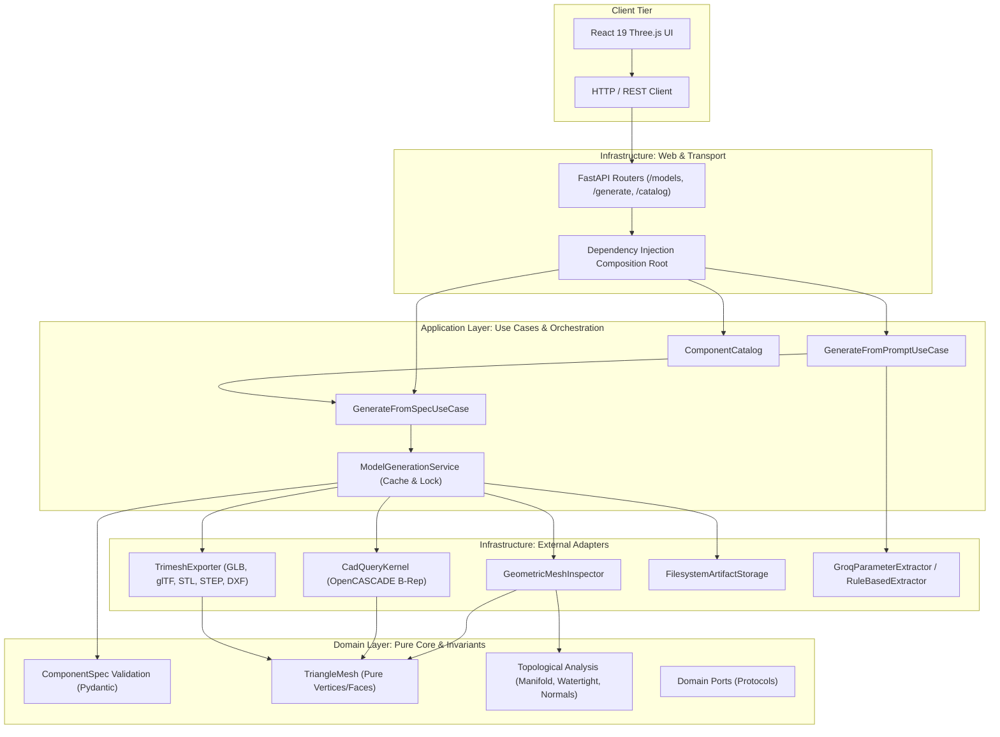

# Architecture Specification: ParametriCAD AI

ParametriCAD AI follows a strict **Hexagonal Architecture (Ports and Adapters)**. The application separates pure business logic and mathematical geometric verification from I/O mechanisms, solid modeling kernels, and transport protocols.

## Architectural Layers

```
+------------------------------------------------------------------------+
|                         Infrastructure Layer                           |
|  [FastAPI HTTP Routes]    [CadQuery/OpenCASCADE]    [Trimesh Exporter] |
|  [Groq / Rule Extractor]  [Filesystem Storage]      [Web 3D Viewer]    |
+-----------------------------------+------------------------------------+
                                    |
+-----------------------------------v------------------------------------+
|                          Application Layer                             |
|  [GenerateFromSpecUseCase]              [GenerateFromPromptUseCase]    |
|  [ModelGenerationService]               [ComponentCatalog]             |
+-----------------------------------+------------------------------------+
                                    |
+-----------------------------------v------------------------------------+
|                            Domain Layer                                |
|  [Pydantic Component Specs]             [TriangleMesh Data Structure]  |
|  [Mesh Quality & Topological Analysis]  [Domain Ports / Protocols]     |
|  [Deterministic Content Key Hash]       [Domain Error Hierarchy]       |
+------------------------------------------------------------------------+
```

## Hexagonal Component Interaction Flow



## Architectural Invariants

1. **Domain Isolation**:
   - `backend/app/domain` contains zero imports of `fastapi`, `starlette`, `cadquery`, `trimesh`, or `groq`.
   - Domain tests run fully in-memory without starting external engines.
2. **Deterministic Quality Verification**:
   - Mesh topological checks (Euler characteristic, boundary edges, manifoldness, normal winding, signed volume) are evaluated in the domain.
   - Any model failing blocking invariants is denied publication when `reject_invalid_meshes` is enabled.
3. **Deterministic Cache & Content Addressing**:
   - `model_id` is an invariant SHA-256 hash computed from canonical JSON parameter strings and tessellation deflections.
