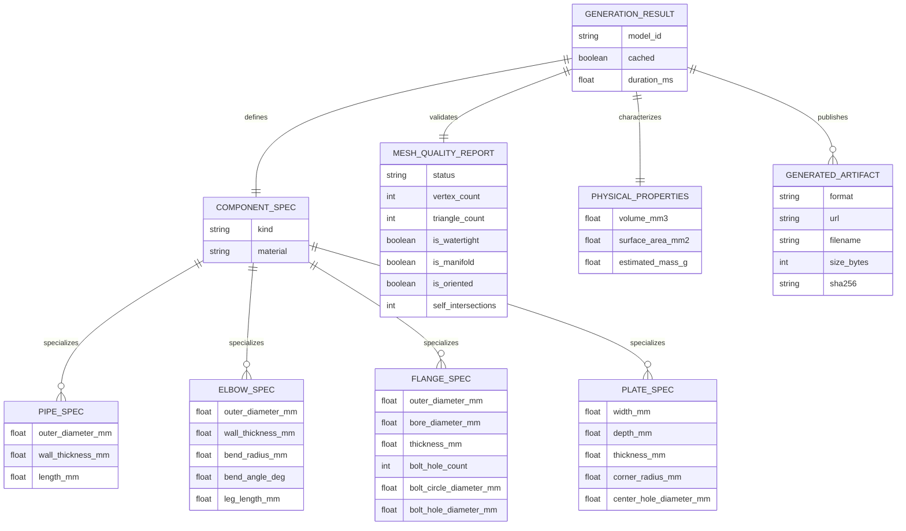

# Data Model: ParametriCAD AI

This document details the core data entities and specifications used across ParametriCAD AI.

## Entity Relationship Diagram

## Invariants & Field Validation

- **Immutability**: All specs inherit from Pydantic `BaseModel` with `frozen = True`, ensuring unalterable hash keys for caching.
- **Physical Feasibility**:
  - `outer_diameter_mm > 2 * wall_thickness_mm`
  - `flange.bore_diameter_mm < flange.outer_diameter_mm`
  - `elbow.bend_radius_mm > outer_diameter_mm / 2`
  - `plate.center_hole_diameter_mm < min(width_mm, depth_mm)`
